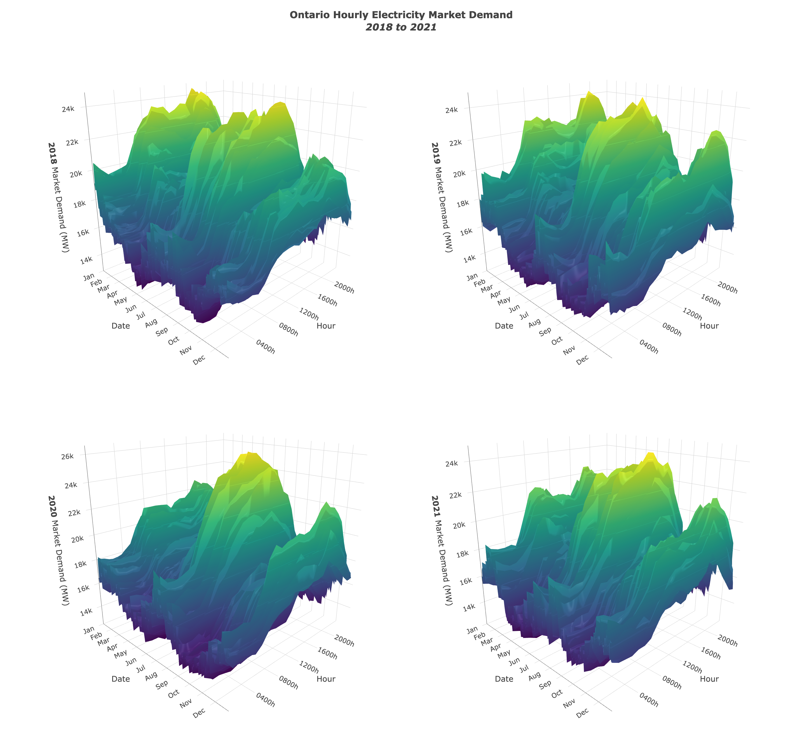

# Visualize Ontario's Electricity Market Demand

***Prepared by Nathan K. Chan***

## Overview

This project produces and hosts **interactive 3D visualizations of Ontario's market demand for electricity** by year, date, and time of day.

Source data are published by the **Independent Electricity Systems Operator (IESO) of Ontario** and are available [here](http://reports.ieso.ca/public/Demand/). 

For information on how to download and run this project, see [**Project Description**](#project-description).

<center></center>

## List of visualizations

Click on a link below to view the respective plot.

**Comparions**

1. [**2018 to 2021 Ontario Hourly Market Demand**](https://nathankchan.github.io/ontario-electricity-demand-viz/plots/2018_to_2021_Ontario_Hourly_Market_Demand_Comparison.html)
2. [**2014 to 2017 Ontario Hourly Market Demand**](https://nathankchan.github.io/ontario-electricity-demand-viz/plots/2014_to_2017_Ontario_Hourly_Market_Demand_Comparison.html)
3. [**2010 to 2013 Ontario Hourly Market Demand**](https://nathankchan.github.io/ontario-electricity-demand-viz/plots/2010_to_2013_Ontario_Hourly_Market_Demand_Comparison.html)
4. [**2006 to 2009 Ontario Hourly Market Demand**](https://nathankchan.github.io/ontario-electricity-demand-viz/plots/2006_to_2009_Ontario_Hourly_Market_Demand_Comparison.html)
5. [**2002 to 2005 Ontario Hourly Market Demand**](https://nathankchan.github.io/ontario-electricity-demand-viz/plots/2002_to_2005_Ontario_Hourly_Market_Demand_Comparison.html)

**Present to 2020**

1. [**2022 Ontario Hourly Market Demand**](https://nathankchan.github.io/ontario-electricity-demand-viz/plots/2022_Ontario_Hourly_Market_Demand.html)
2. [**2021 Ontario Hourly Market Demand**](https://nathankchan.github.io/ontario-electricity-demand-viz/plots/2021_Ontario_Hourly_Market_Demand.html)
3. [**2020 Ontario Hourly Market Demand**](https://nathankchan.github.io/ontario-electricity-demand-viz/plots/2020_Ontario_Hourly_Market_Demand.html)

**2019 to 2010**

1. [**2019 Ontario Hourly Market Demand**](https://nathankchan.github.io/ontario-electricity-demand-viz/plots/2019_Ontario_Hourly_Market_Demand.html)
2. [**2018 Ontario Hourly Market Demand**](https://nathankchan.github.io/ontario-electricity-demand-viz/plots/2018_Ontario_Hourly_Market_Demand.html)
3. [**2017 Ontario Hourly Market Demand**](https://nathankchan.github.io/ontario-electricity-demand-viz/plots/2017_Ontario_Hourly_Market_Demand.html)
4. [**2016 Ontario Hourly Market Demand**](https://nathankchan.github.io/ontario-electricity-demand-viz/plots/2016_Ontario_Hourly_Market_Demand.html)
5. [**2015 Ontario Hourly Market Demand**](https://nathankchan.github.io/ontario-electricity-demand-viz/plots/2015_Ontario_Hourly_Market_Demand.html)
6. [**2014 Ontario Hourly Market Demand**](https://nathankchan.github.io/ontario-electricity-demand-viz/plots/2014_Ontario_Hourly_Market_Demand.html)
7. [**2013 Ontario Hourly Market Demand**](https://nathankchan.github.io/ontario-electricity-demand-viz/plots/2013_Ontario_Hourly_Market_Demand.html)
8. [**2012 Ontario Hourly Market Demand**](https://nathankchan.github.io/ontario-electricity-demand-viz/plots/2012_Ontario_Hourly_Market_Demand.html)
9. [**2011 Ontario Hourly Market Demand**](https://nathankchan.github.io/ontario-electricity-demand-viz/plots/2011_Ontario_Hourly_Market_Demand.html)
10. [**2010 Ontario Hourly Market Demand**](https://nathankchan.github.io/ontario-electricity-demand-viz/plots/2010_Ontario_Hourly_Market_Demand.html)

**2009 to 2002**

1. [**2009 Ontario Hourly Market Demand**](https://nathankchan.github.io/ontario-electricity-demand-viz/plots/2009_Ontario_Hourly_Market_Demand.html)
2. [**2008 Ontario Hourly Market Demand**](https://nathankchan.github.io/ontario-electricity-demand-viz/plots/2008_Ontario_Hourly_Market_Demand.html)
3. [**2007 Ontario Hourly Market Demand**](https://nathankchan.github.io/ontario-electricity-demand-viz/plots/2007_Ontario_Hourly_Market_Demand.html)
4. [**2006 Ontario Hourly Market Demand**](https://nathankchan.github.io/ontario-electricity-demand-viz/plots/2006_Ontario_Hourly_Market_Demand.html)
5. [**2005 Ontario Hourly Market Demand**](https://nathankchan.github.io/ontario-electricity-demand-viz/plots/2005_Ontario_Hourly_Market_Demand.html)
6. [**2004 Ontario Hourly Market Demand**](https://nathankchan.github.io/ontario-electricity-demand-viz/plots/2004_Ontario_Hourly_Market_Demand.html)
7. [**2003 Ontario Hourly Market Demand**](https://nathankchan.github.io/ontario-electricity-demand-viz/plots/2003_Ontario_Hourly_Market_Demand.html)
8. [**2002 Ontario Hourly Market Demand**](https://nathankchan.github.io/ontario-electricity-demand-viz/plots/2002_Ontario_Hourly_Market_Demand.html)

## Project Description

**This project requires** ***R*** **to be installed.** If it is not installed, please visit [r-project.org](https://www.r-project.org/) to download the latest version. This project also requires the following **R** packages to be installed:

  * [*tidyverse*](https://www.tidyverse.org/)
  * [*plotly*](https://plotly.com/r/)
  * [*htmlwidgets*](https://www.htmlwidgets.org/)

To run this project locally, download the repository and set your directory to the project directory. Then, run `run.sh` from terminal. 

Annual hourly demand reports from IESO will be downloaded to `{project_dir}/data`, and 3D surface plots of these data will be provided in `{project_dir}/plots`. For example,

```{sh}
cd {project_dir}
source run.sh
```
